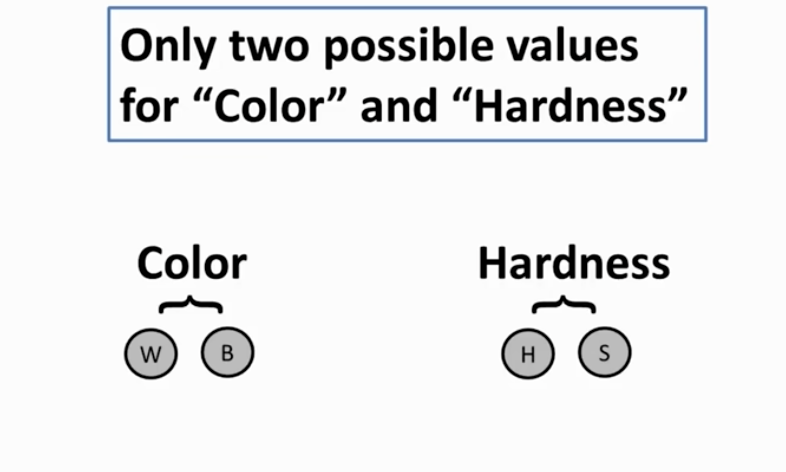
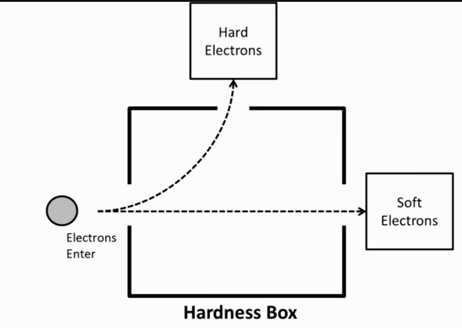
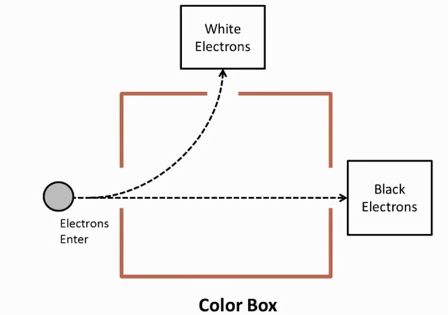

# quantum-fundamentals-algorithms

## quantum super position

Color Box / Hardness Box

# Quantum Fundamentals Implementation:
- [ ] **Assumptions:** 
  - h [hard]
  - s [soft]
  - b [black]
  - w [white]

- [ ] **Basis Transformation Matrix:** Implement the math to show why measuring 
      Hardness ($|H\rangle, |S\rangle$) results in a 50/50 probability
      $n(e^-)$ [random electrons hard/soft] -> [hardness box] ->  results in a 50/50 hard and soft probability.
      
      --------------------------------------------------------
      Color ($|W\rangle, |B\rangle$) results in a 50/50 probability
      $n(e^-)$ [random electrons black/white] -> [color box] ->  results in a 50/50 black and white probability.
      

- [ ] **Probability Weights:** Add support for biased measurements (e.g., what 
      happens if the "Box" is tilted or inefficient).
- [ ] **State History Tracker:** Create a log to show how the electron's 
      properties change over a sequence of measurements (e.g., Color -> Hardness -> Color).
- [ ] **CLI Visualizer:** Build a simple terminal output that mimics the 
      "Color Box" and "Hardness Box" paths shown in the screenshots.
- [ ] **Entanglement Expansion:** Create a 'Pair' struct where measuring 
      Electron A instantly collapses the state of Electron B.

