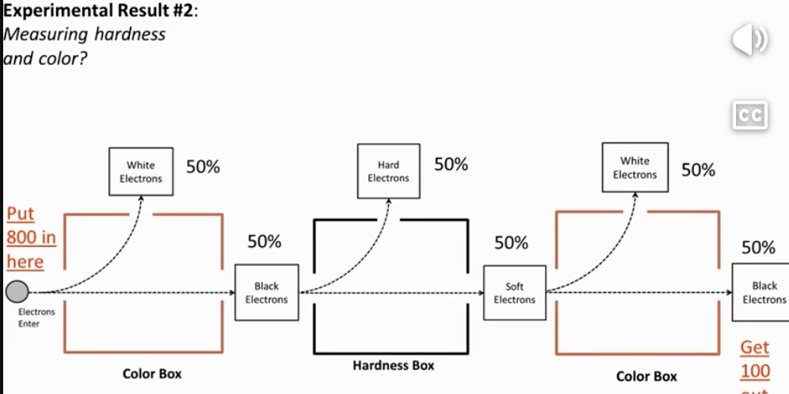
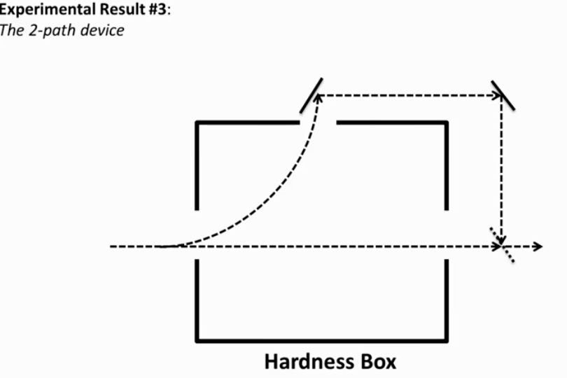

# quantum-fundamentals-algorithms

## quantum super position

#### Color Box / Hardness Box

Basic flow of electrons in QSP

# Quantum Fundamentals Implementation:
- [ ] **Assumptions:** 
  - h [hard]
  - s [soft]
  - b [black]
  - w [white]

- [ ] **Basis Transformation Matrix:** 
    - Implement the math to show why/how it measures
    - Hardness ($|H\rangle, |S\rangle$) results in a 50/50 probability
    - $n(e^-)$ [random electrons hard/soft] -> [hardness box] ->  results in a 50/50 hard and soft probability.
    - 
    - Color ($|W\rangle, |B\rangle$) results in a 50/50 probability
    - $n(e^-)$ [random electrons black/white] -> [color box] ->  results in a 50/50 black and white probability.
    - 

Combined flow of electrons in QSP

# Quantum Fundamentals Implementation:
- [ ] **Assumptions:** 
  - h [hard]
  - s [soft]
  - b [black]
  - w [white]

- [ ] **Experimental Transformation Matrix:** 
    - Implement the math to show why/how it measures
    - Color ($|W\rangle, |B\rangle$) results in a 50/50 probability
    - Hardness ($|H\rangle, |S\rangle$) results in a 50/50 probability
    - Color ($|W\rangle, |B\rangle$) results in a 50/50 probability
    - $n(e^-)$ [random electrons white/black] -> [color box] ->  results in a 50/50 white and black probability -> Input Black $n(e^-)$ to [Hardness box] -> results in a 50/50 hard and soft probability -> Input Soft $n(e^-)$ to [Color box] -> results in a 50/50 white and black probability.
    - 
    - Color ($|W\rangle, |B\rangle$) results in a 50/50 probability
    - $n(e^-)$ [random electrons black\] -> [Hardness box] ->  results in a 50/50 hard and soft probability -> both Hard and Soft $n(e^-)$ combine to be input for [Color box].
    - 
    - - $n(e^-)$ [random electrons white/black] -> [color box] ->  results in a 50/50 white and black probability -> Input Black $n(e^-)$ to [Hardness box] -> results in a 50/50 hard and soft probability -> Input Soft and Hard $n(e^-)$ to [Color box] -> results in a 50/50 white and black probability.
    - 
    - - $n(e^-)$ [random electrons white/black] -> [color box] ->  results in a 50/50 white and black probability -> Input Black $n(e^-)$ to [Hardness box] -> results in a 50/50 hard and soft probability -> Input Soft $n(e^-)$ to [Color box] -> results in a 100 black probability.
    - 

