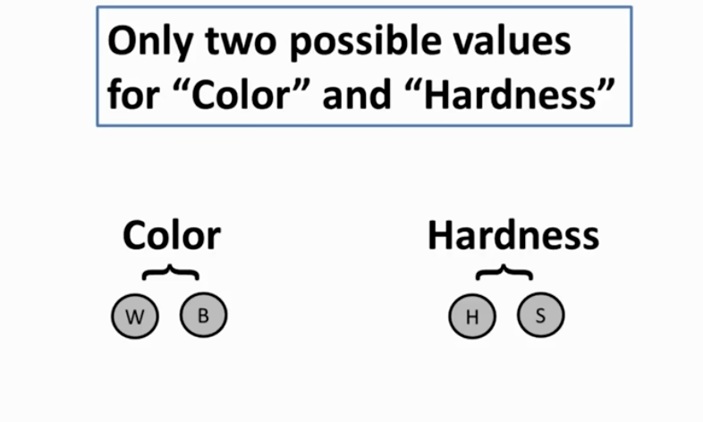
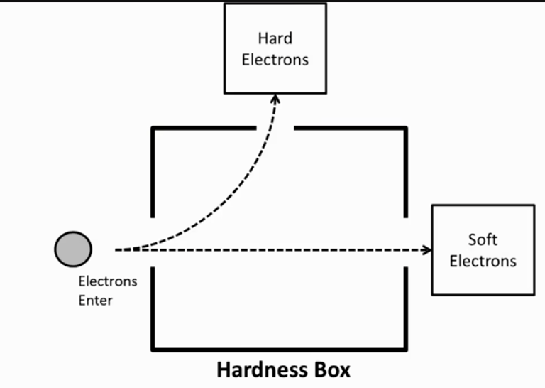
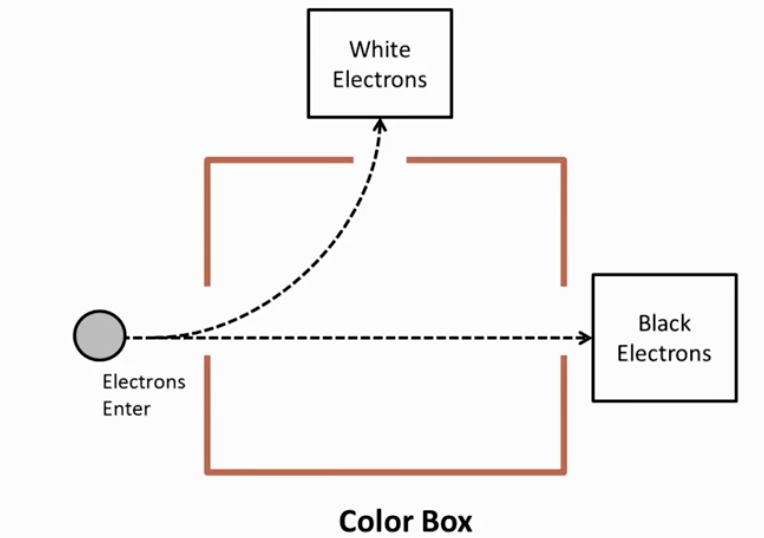
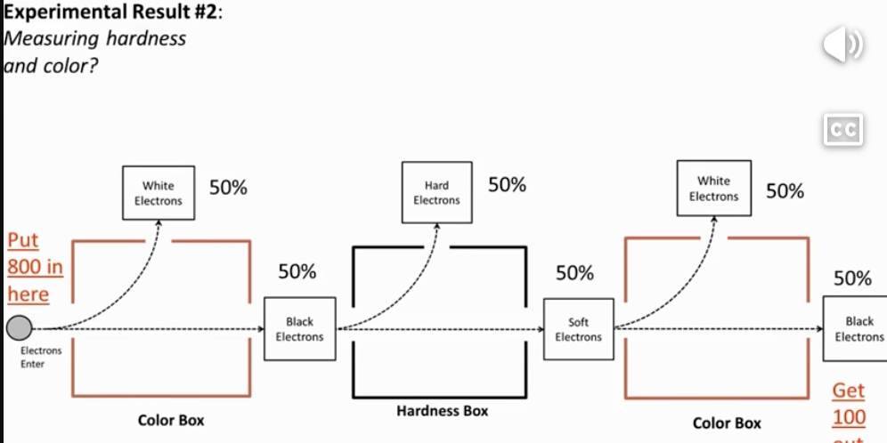
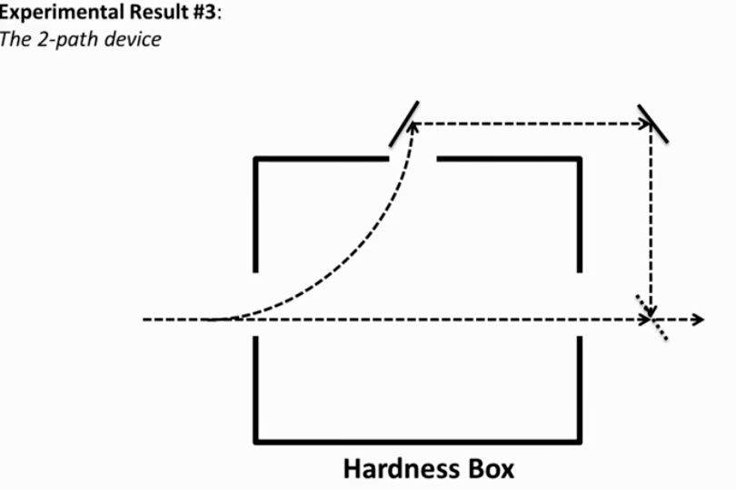

# quantum-fundamentals-algorithms

## quantum super position

#### Color Box / Hardness Box
<details>

<summary>Basic flow of electrons in QSP</summary>

# Quantum Fundamentals Implementation:
- [ ] **Assumptions:** 
  - h [hard]
  - s [soft]
  - b [black]
  - w [white]

- [ ] **Basis Transformation Matrix:** 
    - Implement the math to show why/how it measures
    - Hardness ($|H\rangle, |S\rangle$) results in a 50/50 probability
    - $n(e^-)$ [random electrons hard/soft] -> [hardness box] ->  results in a 50/50 hard and soft probability.
    - 
    - Color ($|W\rangle, |B\rangle$) results in a 50/50 probability
    - $n(e^-)$ [random electrons black/white] -> [color box] ->  results in a 50/50 black and white probability.
    - 

</details>

<details>

<summary>Combined flow of electrons in QSP</summary>

# Quantum Fundamentals Implementation:
- [ ] **Assumptions:** 
  - h [hard]
  - s [soft]
  - b [black]
  - w [white]

- [ ] **Experimental Transformation Matrix:** 
    - Implement the math to show why/how it measures
    - Color ($|W\rangle, |B\rangle$) results in a 50/50 probability
    - Hardness ($|H\rangle, |S\rangle$) results in a 50/50 probability
    - Color ($|W\rangle, |B\rangle$) results in a 50/50 probability
    - $n(e^-)$ [random electrons white/black] -> [color box] ->  results in a 50/50 white and black probability -> Input Black $n(e^-)$ to [Hardness box] -> results in a 50/50 hard and soft probability -> Input Soft $n(e^-)$ to [Color box] -> results in a 50/50 white and black probability.
    - 
    - Color ($|W\rangle, |B\rangle$) results in a 50/50 probability
    - $n(e^-)$ [random electrons black\] -> [Hardness box] ->  results in a 50/50 hard and soft probability -> both Hard and Soft $n(e^-)$ combine to be input for [Color box].
    - 
    - - $n(e^-)$ [random electrons white/black] -> [color box] ->  results in a 50/50 white and black probability -> Input Black $n(e^-)$ to [Hardness box] -> results in a 50/50 hard and soft probability -> Input Soft and Hard $n(e^-)$ to [Color box] -> results in a 50/50 white and black probability.
    - 
    - - $n(e^-)$ [random electrons white/black] -> [color box] ->  results in a 50/50 white and black probability -> Input Black $n(e^-)$ to [Hardness box] -> results in a 50/50 hard and soft probability -> Input Soft $n(e^-)$ to [Color box] -> results in a 100 black probability.
    - 

# SuperPosition:
  - Being everywhere at once.
  -  
# Entanglement
  - Spooky best friends [coin in earth acts as moon]
# Tunneling
  - Walking through walls 

# Story to understand SuperPosition , Entanglement , Tunneling:
```
The Adventure of Quantum Quinn and the Magic Playground
One sunny afternoon, you walked into a very special park called the Quantum Playground. Everything here worked a little bit like magic.

Your friend, Quantum Quinn, ran up to you. "Let's play Hide-and-Seek!" she cheered.

You covered your eyes and counted to ten. One, two, three... While your eyes were closed, Quinn didn't just hide behind the slide. Because of Superposition, she turned into a magical, fuzzy cloud and hid behind the slide, inside the tunnel, and up in the treehouse all at the exact same time! But the second you opened your eyes and yelled "Ready or not, here I come!", the magic cloud popped. Quinn instantly appeared sitting right at the top of the slide.

"Wow, you're fast!" you laughed.

Next, Quinn wanted to say hello to her best friend, who was all the way up on the Moon. "Watch this," she said. She pulled out two glowing Magic Coins. She kept one and magically zoomed the other one up to the Moon.

"These coins are spooky best friends," she whispered. This was Entanglement. She flipped her coin on the grass and slapped her hand over it. "Heads!" she said. Even though her friend was thousands of miles away in space, the friend's coin instantly landed on Heads, too. They didn't even need a telephone to talk; the coins just instantly knew!

Finally, it was time to play catch. But oh no! A giant, heavy brick wall was right in the middle of the playground.

"How are we going to throw the ball over that?" you asked.

Quinn smiled and pulled out a glowing, fuzzy Ghost Ball. "We don't go over. We go through." She rolled the ball right at the solid bricks. Instead of bouncing off with a thud, the ball did a trick called Quantum Tunneling. POP! The ball vanished on your side and magically appeared right on the other side of the solid wall, as if the bricks were made of thin air!

You cheered, realizing that in the Quantum Playground, you can be everywhere at once, talk instantly across the universe, and walk right through walls!
```
</details>